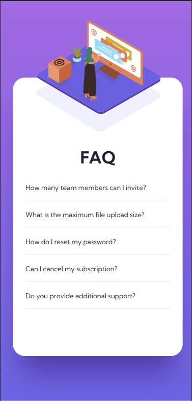

# Frontend Mentor - FAQ accordion card solution

This is a solution to the [FAQ accordion card challenge on Frontend Mentor](https://www.frontendmentor.io/challenges/faq-accordion-card-XlyjD0Oam). Frontend Mentor challenges help you improve your coding skills by building realistic projects. 

## Table of contents

- [Overview](#overview)
  - [The challenge](#the-challenge)
  - [Screenshot](#screenshot)
  - [Links](#links)
- [My process](#my-process)
  - [Built with](#built-with)
  - [What I learned](#what-i-learned)
  - [Continued development](#continued-development)
  - [Useful resources](#useful-resources)
- [Author](#author)
- [Acknowledgments](#acknowledgments)

## Overview

The project consists of creating a FAQ page for a technical site. The accordion style Q/A format, ubiquitous a wide range of websites, features hover effects, expanding <details> sections, caret transition, and open/closed states.

In addition, the challenge has a section of multi-layer, overlapping graphics that combines imcompatible settings for the "overflow."

### The challenge

Frontend Mentor Challenges: users should be able to:

- View the optimal layout for the component depending on their device's screen size
- See hover states for all interactive elements on the page
- Hide/Show the answer to a question when the question is clicked
- Bonus Challenge: build the card using CSS only (no JavaScript)

Personal Challenges:
- "Bonus Challenge," i.e., perform the expansion of the <details> element without using JavaScript
- High level of responsiveness: As the browser window is resized, I wanted the card to resize as well and still stay within its container.
- Increase my speed of producing the code and accuracy in terms of succinctness and efficiency
- Organize my project in a way conducive to collaboration and professionalism

### Screenshot




### Links

- Solution URL: [GitHub Repository](https://github.com/jguleserian/FMC-FAQAccordionCard.git)
- Live Site URL: [GitHub Pages](https://jguleserian.github.io/FMC-FAQAccordionCard/)

## My process

Workflow for CSS only:
1. Set up folders and file structure
2. Determine strategy for structuring the page
3. HTML: set major structure with containers, placing the general content within them
4. HTML: starting from the top with each major container, assign content to individual elements and arrange them as necessary.
5. HTML: link and place <picture> and  / <source> files as necessary. Set media query sizes as necessary.
6. CSS: set up.
  - "Pencil in" the major structure: "reset & variables," "containers," "elements," "classes & ids," "media queries"
  - Write the CSS for the page reset in the ":root," <html>, <body>, and *. I generally put in the variable for colors, font, etc. at this time.
  - Set the media queries, adding in a change of background color so I can visually identify what query I am viewing and to have an element in the query as a placeholder
  - FIRST GIT COMMIT is generally done here
7. Starting from top to bottom in the HTML, set the CSS styles. In setting the styles, I generally organize the structure as follows:
  - structure => dimension
    - display
    - position
    - overall dimension
    - box properties (margin, padding, border)
  - background => foreground
    - background properties
    - typography
  - static => dynamic
    - transformation
    - animation
8. Style/add hover states and animation as necessary
9. Clean up code
10. Test functionality, responsiveness, and similitud with original model in Figma/style guide
11. Upload and publish

### Built with

- Semantic HTML5 markup
- CSS custom properties
- Flexbox
- CSS Grid
- Mobile-first workflow

### What I learned

- While my original intent was to practice my JavaScript skills, I quickly got caught up in the "Bonus Challenge" and found myself learning more about CSS selectors and pseudo elements. If time had permitted, I may have also done a version using JavaScript, but for this first submission, I thought I would avoid complicating things. In the end, I'm glad I took this route since overall, this would result in smaller files, faster page loading, and overall better performance. What I didn't like about it was that generally speaking, I like to leave the functionality to JS; nevertheless, from a pragmatic perspective, the route I took seems more efficient.

- High level of responsiveness. As the browser window is resized, I wanted the card to resize as well and still stay within its container. This works to some degree, but as the browser window approaches the breakpoint at 375px, the illustrations start blocking each other (because I didn't take the time to style the pictures using scalable units), and the text starts extending beyond the container, especially when expanded. I could have fixed this by adding an additional breakpoint, say, at 768px and adjusting the picture elements in eight size or position, but for now I was satisfied with the result I got.

The trickier elements:
1. Layering the three images in the same location so that the lowest two had hiden overflow in their container, but the top layer was supposed to be visible. Here is how I decided to solve it:
  -Bottom two layers as <picture> elements in their own section, which works out because they have to be changed for the mobile breakpoint. I had resisted this at first because my goal was to have the least amount of code necessary, and creating an additional section, with its corresponding code, seemed gratuitous. Nevertheless, since the "overflow" property has to handled by a parent container, in the end, I gave in and did it, as you can see:
  - Top layer as a single image in its own section with a position property defined so this one, too, could be positioned.
  - I used placement with percentages to improve scalability as the brower if resized. However, I did not make the images themselves scalable.
2. The tougher challenge was converting the triangular caret of a <details> tag into an .svg icon, moving it to the right side, and then making it rotate 180deg when the <summary> (1st child of the <details> element) was clicked. Here is how I worked it out:
```
details {
    width: 75%;
    min-height: 3.2rem;
    height: auto;
    margin-top: 1.9rem;
    border-bottom: 1px solid var(--light-gray-blue);
}

details>summary {
    font-weight: 400;
    font-size: 1.4rem;
    line-height: 1.9rem;
    color: var(--blue-dark);
    list-style: none;
}

details>summary:hover {
    color: var(--orange);
}

details>summary::after {
    display: inline;
    content: url("/images/icon-arrow-down.svg");
    float: right;
}

details[open]>summary::after {
    transform: rotate(180deg);
}

details[open]>summary {
    font-weight: 700;
    color: var(--blue-dark);
    cursor: pointer;
}
```
### Continued development

- Increase familiarity with using JavaScript to add functionaltiy
- Speed of producing code
- Increase proficiency in manipulating the pseudo-elements and properties of individual elements such as in this case the ::marker (though I didn't have to use it) and ::after and the properties notation [open].
- Ability to estimate project time

### Useful resources

- [MDN: <details> element](https://developer.mozilla.org/en-US/docs/Web/HTML/Element/details) - While W3Schools also has some great descriptions and tutorials regarding the <details> tag, I found that MDN did a better job by giving more details helpful to accomplish more complex tasks. 
- [DevDocs](https://devdocs.io/) - I love this resource because it offers instant access to some of the most respected documentation on frontend and backend development. There is also a mobile version that I use often. Anyway, it is easy to navigate and is comprehensive. It also allows the user to leave the application and go directly to the source of the information. It also updates to new versions on the fly, so the information you get is aways the most accurate.


## Author

- GitHub - [@jguleserian](https://github.com/jguleserian)
- Frontend Mentor - [@yourusername](https://www.frontendmentor.io/profile/jguleserian)
- LinkedIn - [@yourusername](https://www.linkedin.com/jeffguleserian)


## Acknowledgments

As always, I want to acknowledge all my peers at Frontend Mentor who have offered me suggestions and helpful, constructive criticism. I have been amazed over how much my confidence has grown just by walking through these challenges and having them looked at by others. Thank you all for your help.
